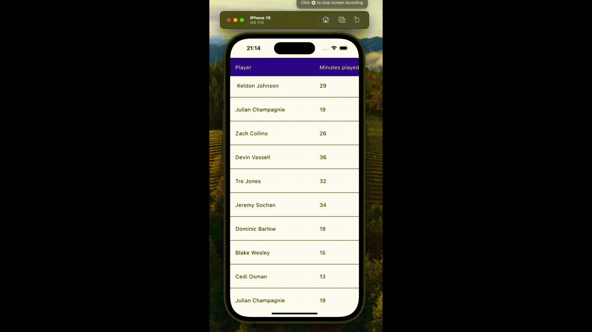
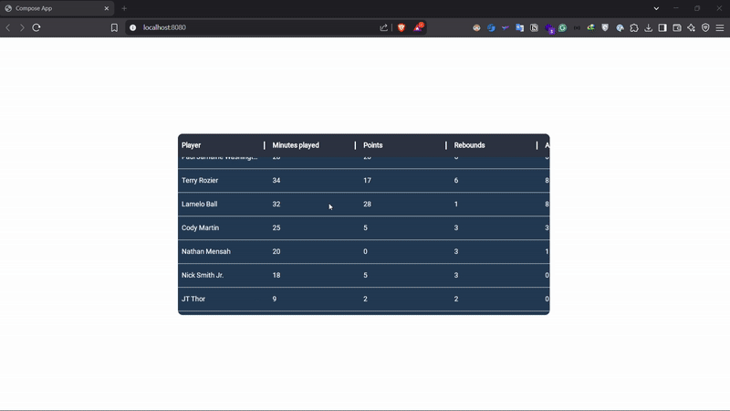

## DataTable

A compose multiplatform library for rendering data in tables. Supports:
- Android
- ios
- Web(Wasm)
- Desktop

### Dependency

```
repositories {  
    mavenCentral()
}
```

```
implementation("io.github.efe-egbevwie:dataTable:0.7.1")
```

### Usage

```kotlin
@Composable
fun DataTableSample(gameStats: List<PlayerStats>, modifier: Modifier = Modifier) {
    LazyDataTable(
        modifier = modifier,
        headerBackgroundColor = Color(0XFF2a3340),
        tableBackgroundColor = Color(0xFF1f3952),
        columnCount = 5,
        rowCount = gameStats.size,
        tableHeaderContent = { columnIndex: Int ->
            val columnText = when (columnIndex) {
                0 -> "Player"
                1 -> "Minutes played"
                2 -> "Points"
                3 -> "Rebounds"
                4 -> "Assists"
                else -> ""
            }

            Text(
                text = columnText,
                color = Color.White,
                fontWeight = FontWeight.Bold,
                maxLines = 1,
                overflow = TextOverflow.Ellipsis,
                modifier = Modifier.padding(vertical = 16.dp, horizontal = 8.dp),
                textAlign = TextAlign.Start
            )
        },
        cellContent = { columnIndex: Int, rowIndex: Int ->
            val cellText = when (columnIndex) {
                0 -> gameStats[rowIndex].playerName
                1 -> gameStats[rowIndex].minutesPlayed.toString()
                2 -> gameStats[rowIndex].points.toString()
                3 -> gameStats[rowIndex].rebounds.toString()
                4 -> gameStats[rowIndex].assists.toString()
                else -> ""
            }

            SelectionContainer {
                Text(
                    text = cellText,
                    maxLines = 1,
                    overflow = TextOverflow.Ellipsis,
                    color = Color.White,
                    modifier = Modifier.padding(vertical = 8.dp, horizontal = 8.dp),
                    textAlign = TextAlign.Start
                )
            }
        }
    )
}
```

<br>
<br>

### Android


<br>
<br>

### ios


### Desktop


### Web(Wasm)



